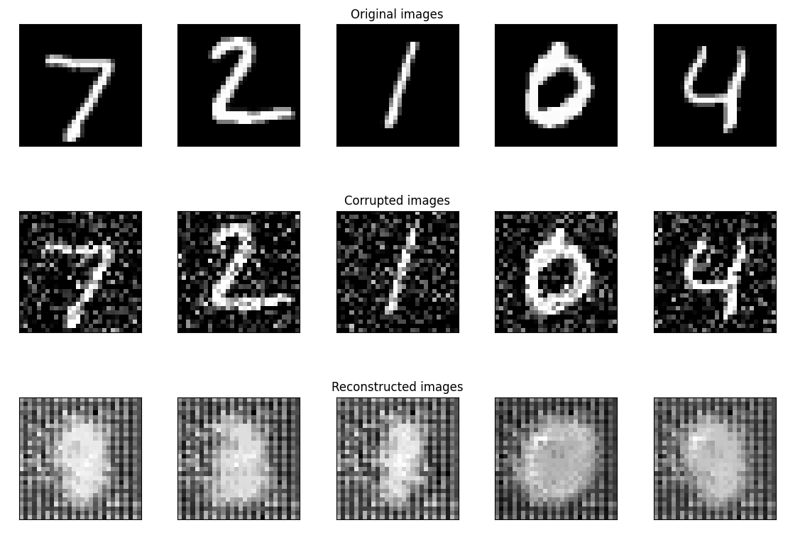

# Denothing: A self-supervised autoencoder-based approach to symbol denoising

Project related to the denoise of digits, numbers and symbols for OCR classification tasks.

## Installation

If you want to use our test and evaluation application, clone the repository and follow the instructions.

## Requirements

* Python 3.6+
* Linux and Windows
* See also requirements.txt and environment.yml files

## Script for installation
For the installation of the _requirements_ and _environment_ run the next script:
* Run: `./install.sh`

If you are under Windows, use directly the _environment.yml_ file to install the 
dependencies (e.g. using conda environment manager: `conda env create -f environment.yml`)

<a name="myfootnote1">1</a>: *Not tested regularly on Windows. Fully tested in Linux Ubuntu O.S.*

## Usage
By default, the application read the data to train in: `/data/`

For training the denoising CAE-based model:
`python ./scripts/denothing_ssl_training.py`

## TODO list
 - [ ] Add configuration files with parameters
 - [ ] GUI
 - [ ] Visualize data
 - [ ] Code cleaning.

## Authors and acknowledgment
This project is created by the staff members of the Center for Machine Vision and Signal Analysis (CMVS) at the University of Oulu:
 * Constantino Álvarez Casado (constantino.alvarezcasado [at] oulu.fi)
 * Tuukka Bogdanoff (email)

## Useful Resources and links of some parts of the code:
- https://github.com/eugeniaring/Medium-Articles/blob/main/Pytorch/convAE.ipynb
- https://github.com/julianstastny/VAE-ResNet18-PyTorch

## License
For open source projects, say how it is licensed.

